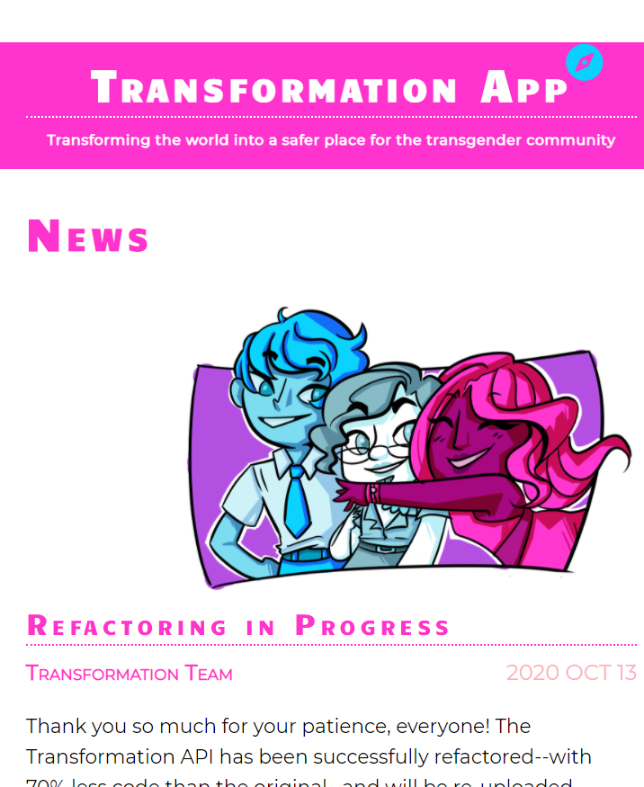
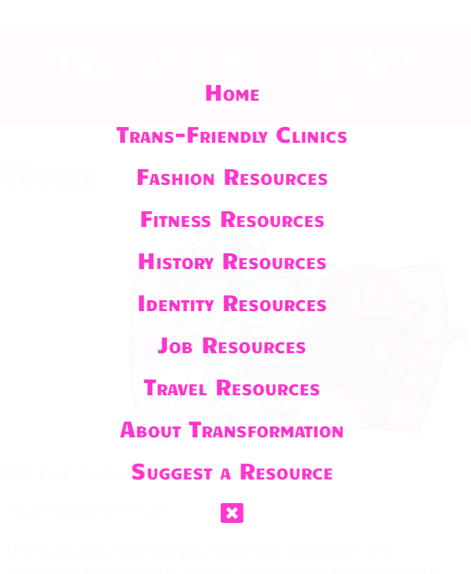
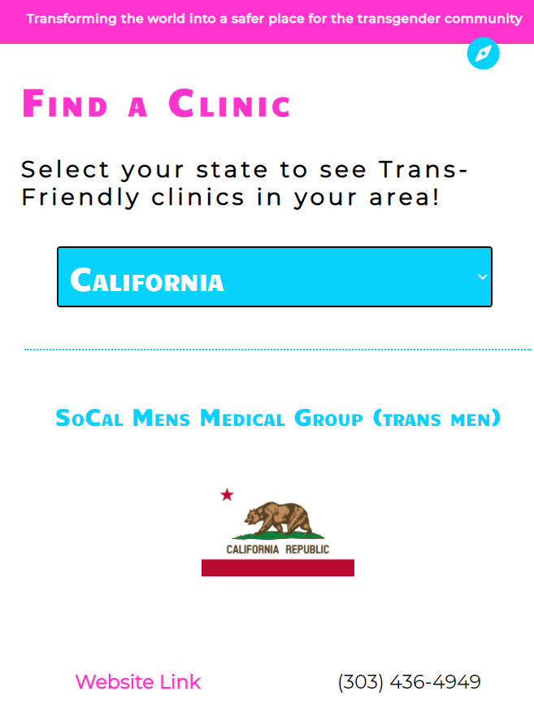

# TRANSFORMATION API (V2)
## BACK END (Golang)
### [Front End](https://github.com/themarkfullton/transformation-app-v2) (React)

**Link to live currently deactivated; considering move to GQL**
**STILL UNDER CONSTRUCTION**

Full Stack. Transforming the world into a safer place for the transgender community! App/API containing a variety of transgender resources (from trans-friendly clinics to information about how to change one's given name)!

## What it contains

### Trans-Friendly Clinics

`https://transformation-api-v2.herokuapp.com/api/clinics`

Will return a JSON object of all the transgender clinics in the database.

**Object:**

name

state

street

city

zip

phone (in (###) ###-### format)

description (explains the services provided by the clinic)

website (returns url of the website as string)

### Trans-Friendly Resources

All of these resources have the same fields:

**Object:**

name

source (the website or author it's from)

target (mtf, ftm, nb, all, identity, or travel)

description

link (returns url of the website as string)

#### Fitness Resources

`https://transformation-api-v2.herokuapp.com/api/fitness`

#### Fashion Resources

`https://transformation-api-v2.herokuapp.com/api/fashion`

#### History Resources

`https://transformation-api-v2.herokuapp.com/api/history`

#### Identity Resources

`https://transformation-api-v2.herokuapp.com/api/identity`

#### Job Resources

`https://transformation-api-v2.herokuapp.com/api/jobs`

#### Travel Resources

`https://transformation-api-v2.herokuapp.com/api/travel`

## Technologies Used

Golang

## Motivation

Finding up-to-date resources as a transgender individual is tough, but essential: It can sometimes mean the difference between life and death. This app was created by transgender individuals for the purpose of making this information readily availiable *to* transgender individuals; to transform the world into a better place.

## Future Plans

The Transformation Team is currently collecting up-to-date information on trans-friendly clinics and working to connect with transgender content creators to provide helpful resources.

We are also considering a move to GQL and are experimenting with different API structures.

## Screenshots

